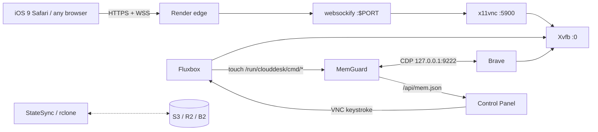

# ☁️ CloudDesk — Browser-in-a-Container for legacy devices

[](https://github.com/majde988/ipad-browser/actions/workflows/ci.yml)
[](LICENSE)
[](https://render.com/deploy?repo=https://github.com/majde988/ipad-browser)

CloudDesk streams a full Linux desktop (Xvfb + Fluxbox + **Brave Browser**) to any web browser
through **noVNC 0.6.2** — the last release that still works on **iOS 9 Safari**. It is tuned to
run on **Render.com Free tier** (512 MB RAM, one exposed port, no persistent disk, no privileged
capabilities), giving a 2013-era iPad a modern, secure browser.

Beyond the classic "VNC-in-a-container" stack, CloudDesk adds **MemGuard**, a swap-less memory
manager that watches cgroup memory and drives Brave through the Chrome DevTools Protocol
(GC → freeze background tabs → park them to disk) *before* the OOM-killer strikes, and a
touch-friendly **control panel** with Arabic text input, sticky modifiers, and live memory stats.

## ✨ Features
- noVNC **0.6.2** pinned + pure **ES5** control panel → works on iOS 9 / old Android
- Runs entirely as non-root user `desk`; single HTTP port (`$PORT`)
- **MemGuard**: 3-tier memory pressure relief, live `/api/mem.json`, manual GC / park / restore
- **Control-over-VNC**: panel commands travel through the already-open VNC channel (no new ports)
- Access modes: open, URL-token (zero typing), Basic-Auth, VNC password
- Optional **StateSync**: bookmarks, sessions & downloads mirrored to free S3-compatible storage (rclone)
- Self-healing: supervisord auto-restart, lock-file cleanup, client-side auto-reconnect

## 🏗 Architecture

See [docs/architecture.md](docs/architecture.md) for boot sequence and the memory state machine.

## 🚀 Quick start
**Local (Docker Compose)**
```bash
docker compose up -d --build
open http://localhost:10000/vnc_auto.html
```
**Render (Blueprint)** — New → Blueprint → select this repo → Apply. `render.yaml` provisions everything.
First build takes ~8 min (Brave download). Then open
`https://<service>.onrender.com/vnc_auto.html?path=websockify%3Ftoken%3D<ACCESS_TOKEN>`
(token is in Render → Environment).

## 🔐 Access modes
| Mode | Set | Security | Ease on iPad |
|---|---|---|---|
| Open | nothing | ❌ anyone with URL | ⭐⭐⭐ |
| **URL token** (default on Render) | `ACCESS_TOKEN` | ✅ good | ⭐⭐⭐ — bookmark once ("Add to Home Screen"), zero typing |
| Basic-Auth | `WEB_USER` + `WEB_PASSWORD` | ✅ good | ⭐ browser prompt each session |
| VNC password | `VNC_PASSWORD` | ✅ good | ⭐ typed in noVNC each session |

Rotate the token from Render's Environment tab to instantly invalidate old links.

## ⚙️ Environment variables
| Variable | Default | Description |
|---|---|---|
| `SCREEN_WIDTH` / `SCREEN_HEIGHT` / `SCREEN_DEPTH` | `1024` / `768` / `16` | Virtual screen; 16-bit halves bandwidth |
| `NOVNC_PORT` | `10000` | HTTP port (overridden by Render's `$PORT`) |
| `VNC_PORT` | `5900` | Internal VNC port (loopback only) |
| `ACCESS_TOKEN` | `""` | URL-token auth via websockify TokenFile |
| `VNC_PASSWORD` | `""` | Classic VNC password |
| `WEB_USER` / `WEB_PASSWORD` | `""` | HTTP Basic-Auth on the web endpoint |
| `ENABLE_CLIPBOARD` | `false` | Share clipboard over VNC |
| `START_URL` | `https://www.google.com` | Brave start page |
| `BRAVE_LANG` | `ar` | Brave UI language |
| `BRAVE_HEAP_MB` | `128` | V8 old-space limit |
| `BRAVE_CACHE_MB` | `200` | On-disk HTTP cache (pushes memory to disk) |
| `BRAVE_DARK` | `true` | Force dark mode |
| `WALLPAPER_URL` | `""` | Custom wallpaper |
| `TZ` | `Africa/Algiers` | Timezone |
| `MALLOC_ARENA_MAX` | `2` | glibc arenas (less fragmentation) |
| `MEM_LIMIT_MB` | `512` | Memory budget MemGuard reasons about |
| `MEMGUARD_SOFT` / `HARD` / `CRIT` | `70` / `82` / `92` | Tier thresholds (%) |
| `MEMGUARD_INTERVAL` / `COOLDOWN` | `3` / `20` | Poll interval / seconds between same-tier actions |
| `STATE_REMOTE` | `""` | rclone remote (e.g. `cloud:bucket`) — enables StateSync |
| `STATE_SYNC_SEC` | `300` | Sync period |
| `RCLONE_CONFIG_CLOUD_*` | — | rclone remote definition via env (see `render.yaml`) |

## 🎛 Control panel
Tabs: **رئيسي** (navigation, copy/paste, zoom) · **تطبيقات** (Brave, files, terminal, Geany) ·
**كتابة** (Unicode/Arabic text injection via X11 keysyms) · **مفاتيح** (sticky Ctrl/Alt/Shift, arrows, F-keys) ·
**🧠 الذاكرة** (live usage bar, GC / park / restore) · **إعدادات** (human-like pointer, auto-reconnect).

| Shortcut | Action |
|---|---|
| Ctrl+Alt+B / E / T / F | Brave / Geany / Terminal / Files |
| Ctrl+Alt+D · Alt+F4 · Alt+Tab | Show desktop · Close · Switch window |
| Ctrl+Alt+Shift+G / P / R | MemGuard: GC / park background / restore |

## 🧠 MemGuard — swap-less memory management
Real swap needs `CAP_SYS_ADMIN`, unavailable in unprivileged containers. MemGuard instead reads
cgroup memory every 3 s and escalates through Brave's DevTools protocol:

| Tier | Trigger | Action |
|---|---|---|
| 1 Soft | ≥ 70 % | `Memory.simulatePressureNotification(moderate)` → GC, cache trimming |
| 2 Hard | ≥ 82 % | critical pressure + `Page.setWebLifecycleState(frozen)` on background tabs |
| 3 Critical | ≥ 92 % | **park** oldest background tabs: replace content with a tiny `data:` page that restores the URL on focus |

Status is published atomically to `/api/mem.json`; commands arrive as files in `/run/clouddesk/cmd/`
created by Fluxbox key bindings — so the authenticated VNC channel doubles as the command channel.

## ⚠️ Known limitations
- Render Free: no persistent disk (use StateSync), spin-down after 15 min idle, 512 MB.
- `--no-sandbox` is required (Docker's default seccomp blocks user namespaces).
- Brave packages are **amd64 only**.
- A single very heavy page can still exceed the budget; supervisord restarts Brave with `--restore-last-session`.

## 🔒 Security notes
Set `ACCESS_TOKEN` (or a password mode) on any public deployment · port 9222 (CDP) is loopback-only ·
all services run as `desk` · `no-new-privileges` in compose.

---

## 🇩🇿 بالعربية
**CloudDesk** يبثّ سطح مكتب Linux كامل (Xvfb + Fluxbox + متصفح Brave) إلى أي متصفح عبر noVNC 0.6.2،
وهو آخر إصدار يعمل على **iOS 9**. مُهيّأ للعمل على الخطة المجانية في Render (512MB، منفذ واحد، بلا قرص دائم).

**الإضافات الأساسية:**
- **MemGuard**: مدير ذاكرة بلا swap يعمل على 3 مستويات (تنظيف → تجميد التبويبات الخلفية → ركنها على القرص) قبل أن يتدخل OOM-Killer.
- **لوحة تحكم** تعمل باللمس: كتابة نص عربي مباشرة، مفاتيح لاصقة، تبويب الذاكرة الحيّ، إعادة اتصال تلقائية.
- **أنماط الوصول**: مفتوح / رمز في الرابط (بلا كتابة — احفظه على الشاشة الرئيسية مرة واحدة) / Basic-Auth / كلمة مرور VNC.
- **StateSync** اختياري: مزامنة الجلسة والتنزيلات مع تخزين سحابي مجاني عبر rclone.

**التشغيل:** محلياً `docker compose up -d --build` · على Render: New → Blueprint → اختر المستودع → Apply،
ثم افتح `https://<الخدمة>.onrender.com/vnc_auto.html?path=websockify%3Ftoken%3D<ACCESS_TOKEN>`.

المشروع مقدَّم كمشروع تخرج؛ راجع `docs/architecture.md` للقرارات التصميمية والمقايضات.
