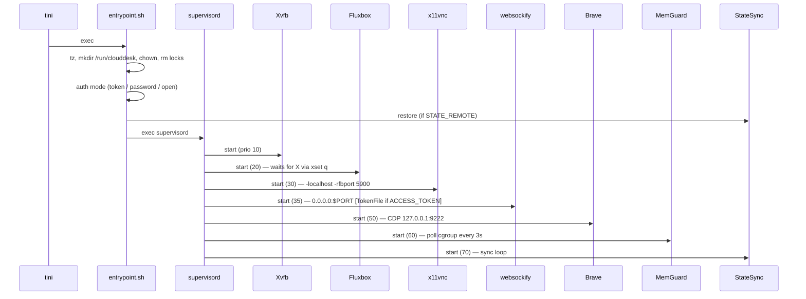

# CloudDesk — Architecture

## Components
| Component | Process owner | Priority | Restart policy | Purpose |
|---|---|---|---|---|
| tini | root (PID 1) | — | — | Signal forwarding, zombie reaping |
| entrypoint.sh | root → exec | — | — | One-shot init: timezone, dirs, lock cleanup, auth mode, state restore |
| supervisord | root | — | — | Process supervision, ordered start, log routing |
| Xvfb | desk | 10 | always | Virtual X server (file-backed framebuffer) |
| Fluxbox | desk | 20 | always | Window manager, key bindings = command channel |
| x11vnc | desk | 30 | always | RFB server on 127.0.0.1:5900 |
| websockify | desk | 35 | always | WebSocket↔VNC bridge + static files on `$PORT` |
| Brave | desk | 50 | always (10 retries) | Browser; CDP on 127.0.0.1:9222 |
| MemGuard | desk | 60 | always | Memory pressure controller + status API |
| StateSync | desk | 70 | unexpected | Periodic rclone mirror (exits 0 when disabled) |

## Boot sequence

## Memory pressure state machine

```mermaid
stateDiagram-v2
  [*] --> Normal
  Normal --> Soft: usage ≥ 70%
  Soft --> Hard: usage ≥ 82%
  Hard --> Critical: usage ≥ 92%
  Soft --> Normal: usage < 70% (log "recovered")
  Hard --> Normal: usage < 70%
  Critical --> Normal: usage < 70%
  Soft: simulatePressure(moderate) on all tabs
  Hard: simulatePressure(critical) + purge JS heap\nsetWebLifecycleState(frozen) on background tabs
  Critical: park oldest 50% of background tabs\n(navigate to data: placeholder, URL kept)
  note right of Soft: same-tier re-action only after COOLDOWN (20s);\nescalation is immediate
```

## Data & control flows
- **Status**: MemGuard → atomic write `/run/clouddesk/api/mem.json` → symlink `/usr/share/novnc/api` → panel polls via XHR every 3 s.
- **Commands (Control-over-VNC)**: panel sends `Ctrl+Alt+Shift+{g,p,r}` over RFB → Fluxbox `Exec touch /run/clouddesk/cmd/{gc,park,restore}` → MemGuard consumes and deletes the file.
- **Auth**: websockify TokenFile maps `?token=` to `127.0.0.1:5900`; without a valid token no VNC upgrade happens. CDP port is never exposed.

## Design decisions & trade-offs
| Decision | Why | Trade-off |
|---|---|---|
| noVNC pinned to 0.6.2 | Only release supporting iOS 9 Safari | Older API (`UI.rfb`, `_rfb_state`); panel written in ES5 |
| One `svc.sh` launcher | Env-driven args, `wait_for_x`, single place for flags | Slightly indirect supervisord config |
| MemGuard via CDP instead of swap | Swap impossible without CAP_SYS_ADMIN; Chromium on Linux has no OS memory-pressure monitor | Cannot save a single oversized page; relies on tab granularity |
| File-based status/command channel | No extra ports, reuses authenticated VNC path, trivial on iOS 9 | ~3 s latency, one-directional polling |
| Xvfb `-fbdir` + large disk cache | Convert anonymous memory into file-backed pages the kernel can evict | Small gain (tens of MB); disk I/O on Render is ephemeral |
| URL token as default auth | Zero typing on old tablets; rotation from dashboard | Token visible in bookmarks/history of the client device |
| Non-root + `--no-sandbox` | Least privilege where possible; Docker seccomp blocks Chrome's user-ns sandbox | Renderer isolation reduced; mitigated by non-root and single-user use |
| Render Free constraints as design inputs | 512 MB, `$PORT`, ephemeral FS, spin-down | Session lost after idle; StateSync + `--restore-last-session` mitigate |
